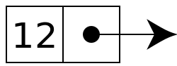
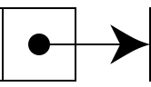

# Linked List

A linked list is a linear data structure, in which the elements are not
stored at contiguous memory locations. The elements in a linked list are
linked using pointers as shown in the below image:

A linked list consists of `nodes`:

Each node consists of a `value` and a `pointer` to another node:

The starting node of a linked list is referred to as the `head`.

Essentially, linked list is a chain of values connected with pointers.

This structure allows for efficient insertion or removal of elements
from any position in the sequence during iteration. More complex
variants add additional links, allowing more efficient insertion or
removal of nodes at arbitrary positions.

A drawback of linked lists is that access time is linear (and difficult
to pipeline). Faster access, such as random access, is not feasible.
Arrays have better cache locality compared to linked lists.

Linked lists are among the simplest and most common data structures.
They can be used to implement several other common abstract data types,
including lists, stacks, queues, associative arrays, and S-expressions,
though it is not uncommon to implement those data structures directly
without using a linked list as the basis.

# Pros and Cons
Linked list is often compared to arrays.

Whereas an array is a fixed size of sequence, a linked list can have its
elements to be dynamically allocated. What are the pros and cons of
these characteristics? Here are some major ones:

## Advantages
- **A linked list saves memory.** It only allocates the memory required
for values to be stored. In arrays, you have to set an array size before
filling it with values, which can potentially waste memory.

- **Linked list nodes can live anywhere in the memory.** Whereas an
array requires a sequence of memory to be initiated, as long as the
references are updated, each linked list node can be flexibly moved to a
different address.

## Disadvantages
- **Linear look up time.** When looking for a value in a linked list,
you have to start from the beginning of chain, and check one element at
a time for a value you’re looking for. If the linked list is n elements
long, this can take up to n time. On the contrary many languages allow
constant lookups in arrays. They are thus inherently sequential access.

- **They use more memory than arrays.** This is because of the storage used by
their pointers.

- **Nodes are stored incontiguously.** It greatly increases the time
periods required to access individual elements within the list,
especially with a CPU cache.

- **Difficulties arise with reverse traversing**. For instance, singly
linked lists are cumbersome to navigate backwards and while doubly
linked lists are somewhat easier to read, memory is consumed in
allocating space for a back-pointer.
