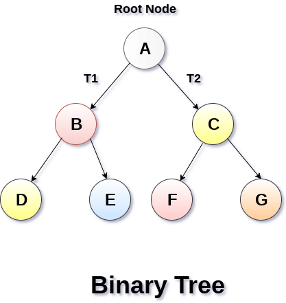

# Binary Tree

A Binary Tree is a tree data structure in which each node has at most two
children, which are referred to as the left child and the right child
and the topmost node in the tree is called the root.

It's a special type of generic tree in which, each node can have at most
two children. Binary tree is generally partitioned into three disjoint
subsets.

- Root of the node
- left sub-tree which is also a binary tree.
- right binary sub-tree which is also a binary tree
