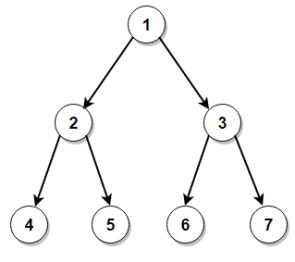

# Heap

<!-- A Binary Search Tree is a tree data structure. -->

<!--  -->

<!-- A Binary Search Tree node contains following parts. -->

<!-- - Data -->
<!-- - Pointer to left child -->
<!-- - Pointer to right child -->
